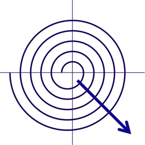

# Introduction to Software Engineering

This repo contains the lecture material for the Bachelor level course “Introduction to Software Engineering”.
Several of the lectures are given by guest speakers. This repo only contains the material for the non-guest lectures.

The course was last held in the Fall of 2021.

## Description

This course is intended for Bachelors students in the third semester studying a major or minor in Computer Science. The goal of this course is to provide an introduction to the key concepts of Software Engineering.

## Learning Outcomes

The course will focus on the use of agile software processes, object-oriented methods, UML and other industrial best practices to successful completion of software projects. The following themes will be explored:

- How can you effectively determine and agree on what a customers really needs?
- How can you ensure that the software product being developed will satisfy non-functional requirements, such as user-friendliness, robustness,reliability and extensibility?
- How do you plan a software project and manage a project developed in a team?
- What tools are available to help support you in a software project?

The exercises for the course will consist of a small software project to be developed by the students in teams over the course of the semester.

## Slides

The slides have been prepared with Apple Keynote. Interspersed with the slideware are hidden slides containing notes for students. PDF versions of the slides can be found [here](http://scg.unibe.ch/download/lectures/ese/).

The figures for the slides have mostly been prepared using [OmniGraffle](https://www.omnigroup.com/omnigraffle/).

## Repo

This repo lives on [github](https://github.com/onierstrasz/course-intro-se).
Further resources can be found on the [course web site](http://scg.unibe.ch/teaching/ese).

This work is licensed under a [Creative Commons Attribution-ShareAlike 4.0 International License](http://creativecommons.org/licenses/by-sa/4.0/).

---
